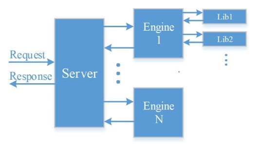

# EVG auto-deploy
本框架主要适用于CV相关的小流量的,追求快速上线的服务,通过CI/CD,可以快速部署服务.  
使用过程中,如果遇到无法解决的问题, 请联系leader提需求.  
欢迎补充文档, 避免更多人遇到相同的问题:), 补充文档请提MR至本分支.

## 版本信息
### content:
1. 为消除安全隐患, 将`service`类型由`NodePort`修改为`ClusterIP`
2. 迁移至新加坡集群, 用户只需要修改`.gitlab-ci.yml`中的`<phase>.environment.name=sg`即可.
3. redis迁移至新加坡集群.

### content-1.0:
1. 迁入flask-deploy
2. 优化`config.yaml`中的配置项
3. 优化路由规则
4. 新增数据上报功能,上报至大数据平台
5. 更换redis:使用性能更优, 更加稳定的codis服务器, 默认关闭(启用引入相应的库即可:`from src.utils import redis_client`)
6. 模型镜像加上日期时间标签, 确保每次更新服务的同时, 重新拉取模型镜像

## 集群信息
目前内容生产使用的的机器迁移至新加坡.  
每台机器有32个核,128G内存;GPU为2080Ti,显存10G;CUDA版本为11.0,CUDA driver版本为450.80.02  
基于安全性考虑, 目前不建议使用NodePort. 原有服务(已经开放了NodePort)请谨慎使用.  
### 域名
infer-sg: `http://infer-audit-sg.ingress.ml.bigo.inner:8080`
### 监控
可以在[Grafana页面](http://metrics-sysop.bigo.sg/d/LJ_uJAvmk/istio-service-dashboard?orgId=1&refresh=5m&var-cluster=infer-sg)查看服务状态.  
具体使用方法见[`example/grafana.md`](example/grafana.md).
请在上方`Service`选择框里搜索自己的服务(名称中含有`-cgi`的选项). 注意区分灰度和生产环境.
### 数据上报
支持将数据上报至大数据平台, 数据保存期限30天, 按需使用.使用方法见[`example/data_report.md](example/data_report.md).

## 使用方法
1. 将推理模型打包为docker镜像,打包方法参考[这里](example/model_serving).
2. 在`content`分支(或标有tag:`content-<version>`的版本)的基础上新建分支(业务分支建议统一命名为`deploy/<project_name>`),进行服务的开发.
3. 修改`config.yaml`文件,更新配置.请不要随意增减配置项.
4. 在`server.py`里实现与后台定义好的http服务接口(不要删除其中的`ping`接口), 接口定义参考`example/interface.md`.
5. 在`src`下面实现具体的解决方案.
6. 在对应的gitlab CI/CD里手动创建灰度部署,进行测试(`scripts/benchmark.py`).测试无误后,下线灰度部署,手动创建生产部署.
7. 查看注意事项,并遵循其中的约定.
8. 模型或代码的更新请重复以上1,3,5,6步骤.

## 注意事项
1. content分支不接受任何业务相关的Merge Request. content会有一些bug的修复或者新功能的添加,建议content分支有更新时,merge到业务分支.
2. 在`server.py`中只需要实现`/api/content/`前缀的接口即可(例:`"{}/gen_image".format(INTERFACE_PREFIX)`). 然后在发送请求(`scripts/benchmark`)时:如果是灰度环境(集群会自动重定向),请求前缀为`/api/grey/content/`;如果是生产环境,请求前缀为`/api/content/`.请求的url示例:
   - 灰度: `http://infer-audit-sg.ingress.ml.bigo.inner:8080/api/grey/content/auto-deploy/gen_image`
   - 生产: `http://infer-audit-sg.ingress.ml.bigo.inner:8080/api/content/auto-deploy/gen_image`
3. 请不要在gitlab CI/CD下上线或下线他人的服务.
4. 请在`src/requirements.txt`下添加所需的额外的依赖,`docker/base/requirements.txt`可以查看已经安装的依赖.
5. 每个服务(包括模型)的最小replicas推荐设置为2,防止服务不可用时(如宕机,更新服务),服务请求失败.为防止机器资源的浪费,灰度环境下强制设置所有deployment的replicas为1,及其他资源限制, 生产环境下的replicas和资源, 与`config.yaml`中的设置一致.所以请在本地或生产环境进行压测.
6. 如果有多个模型,推荐将小模型或者调用量不高的模型ensemble,参考这里的[多模型部署](example/model_serving).这样可以提高gpu的利用率,优化成本.
7. 部署到生产环境之后,推荐将模型进行预热,降低服务初始请求的延时,运行`scripts/benchmark.py`里的`pressure()`(也可用于测试QPS)即可.注意要修改请求的接口.
8. 切记在灰度环境下测试无误,可以得到正确的结果之后,再部署到生产环境.
9.  新加坡集群没有配置rancher页面, 只有一个比较简陋的页面查看服务:`http://202.63.35.85:1212/api/ns`
10. 更多信息见master分支.

### 常见问题
1. Q: 如何配置模型推理服务?  
   A: 模型是通过环境变量的方式进行配置的.`src/libs/tf_rpc_client.py`是一个tf-serving grpc接口的调用示例.这里调用需要模型的domain和name,domain就是在`src/models_info.py`里配置的,name是在模型打包的时候设置的.
2. Q: rancher上模型的deployment出现`ImagePullBackOff`错误,该怎么办?  
   A: 请检查模型的docker image是否push到根目录为`harbor.bigo.sg/bigo_ai`的路径下, 目前集群仅设置了这一个根目录的凭证.
3. Q: 我的分支需要使用submodule, 但是CI的build阶段Clone出错,该怎么办?  
   A: 首先根据[gitlab-ci submodule文档](https://docs.gitlab.com/ee/ci/git_submodules.html)正确导入submodule, 然后将`.gitlab-ci.yml`中第二行的`GIT_SUBMODULE_STRATEGY`的值修改为`none`, 最后将标有`for submodule`的行取消注释,重新push即可.
4. Q: 我的pod一直在重启,有时候也可以返回正确的结果,是怎么回事?  
   A: 请检查`server.py`文件是否将`"/api/ping"`这个接口删除,如果删除了请按照原`server.py`的写法将该接口添加上. 该接口是线上服务进行健康检查的接口,必须实现,否则当k8s发现该接口无法访问时就会进行重启.
5. Q: `config.yaml`中的`model["name"]`与模型推理接口(及`models_info.py`)中的`model_name`有什么区别?  
   A: `config.yaml`中配置的`model["name"]`作用域仅限于该文件(主要是作为k8s上相应deployment/service的名称)。而模型推理接口(及`models_info.py`)中的`model_name`用于指定要进行推理的模型，需要与构建docker镜像时设置的`model_name`一致.
6. Q: clone仓库耗时太久,怎么办?  
   A: 由于本仓库分支众多,导致仓库很大,clone的时候请指定分支,像这样:  
   `git clone -b content --depth 1 https://git.sysop.bigo.sg/infer-serving/flask-deploy.git`
7. Q: 服务状态显示为红色的`Scheduling`是什么情况?  
   A: cgi状态为`Scheduling`说明集群CPU或memory资源不足.模型状态为`Scheduling`说明GPU资源不足.出现上述两种情况,请联系组内负责人申请机器资源或优化现有资源配额.
8. Q: 使用URL访问服务出现`404 NOT FOUND`, 但是使用IP+端口(NodePort)可以连通是什么情况?  
   A: 案例一: 已有`comics`服务, 新开发了一个名为`comics-bg`的服务, 由于k8s路由是匹配前缀, 那么`comics-bg`服务就会路由到`comics`服务,但是`comics`服务没有实现`comics-bg`的接口,所以会404.  
   解决方案: 修改服务名, 前缀不与已有服务完全匹配. 比如这个案例中, 服务名不能为`comics*`, 服务名修改为`bg-comics`或`another-service`都可以解决问题.
9. Q: 我的服务只能在公司内网访问, 外网无法访问, 怎么办?  
   A: 当前域名只能在公司内网进行解析. 一般来说, 我们的服务都是先通过客户端将请求发送到后台, 然后后台在内网环境下解析我们的域名, 然后使用我们的服务. 但是有可能存在客户端不经过后台, 直接使用我们的服务的情况(不推荐), 我们提供了外网域名: `http://infer-sg.ingress.bigoml.cc:8080`, 该域名与前述的域名功能一样, 只是提供了外网访问功能.

## 更多
### Gunicorn
本框架使用Flask + Gunicorn的http服务部署方案.  
使用Gunicorn控制进程&线程的数量，并对请求进行分发,默认使用32个进程.flask是一个十分轻量的web应用框架,这也就导致了本框架在处理http请求时,不具有负载均衡(k8s里具有负载均衡功能,所以就需要根据请求量增减服务的replicas),连接保持等功能.

### 部署
当push代码后, 首先会在CI的Build阶段将本分支的代码打包成一个docker image, 并将commit id作为tag. 然后调用`deploy/generater.py`生成k8s部署的yaml文件, 包括: CGI的deployment/service(本分支的代码, 不分配gpu), 每个模型的deployment/service,以及相应的namspace和ingress. 最后在CI的Gray阶段和Production阶段调用`kubectl apply -f deploy-<phase>.yaml`进行部署, 在CI的Stop_gray阶段调用`kubectl delete -f deploy-gray.yaml`删除灰度部署.

### 代码结构
下图展示了基本的代码调用逻辑:  
  
当客户端发起请求时, 首先通过`server.py`解析http请求参数, 从CDN上下载数据并解码; 然后调用`src/engine.py`, 根据参数,调用指定的处理逻辑, 并完成编码等处理;`src/libs`是核心的处理逻辑,主要进行数据的前后处理及模型推理操作.  
推荐使用上述的代码调用逻辑关系编写代码,将代码进行解耦合,方便调试及后续的迭代开发.

### 模型文件
模型文件建议放入`models`,并使用LFS存储文件, 不过由于公司Git LFS的配置，超过300M的文件就无法直接上传，此时建议先对文件进行split操作，然后在打包镜像的时候进行Merge操作.  
使用方法: `git lfs track "models/**"`
模型分割合并方法：
1. 分割模型  
    `split -b 100000000 ${filename} ${filename}- && rm ${filename}`
2. 合并模型  
    `cat ${filename}-* > ${filename} && rm ${filename}-*`

### 告警模块
告警功能使用的是公司的棱镜系统, 自定义告警请点[这里](http://mon.sysop.bigo.sg/metrics_admin.html).  
目前已添加了一个告警策略, 推荐在`server.py`中, 每个接口处添加. 当线上服务出现问题时, 可以第一时间在企业微信"内容生产监控告警"群里收到通知.
