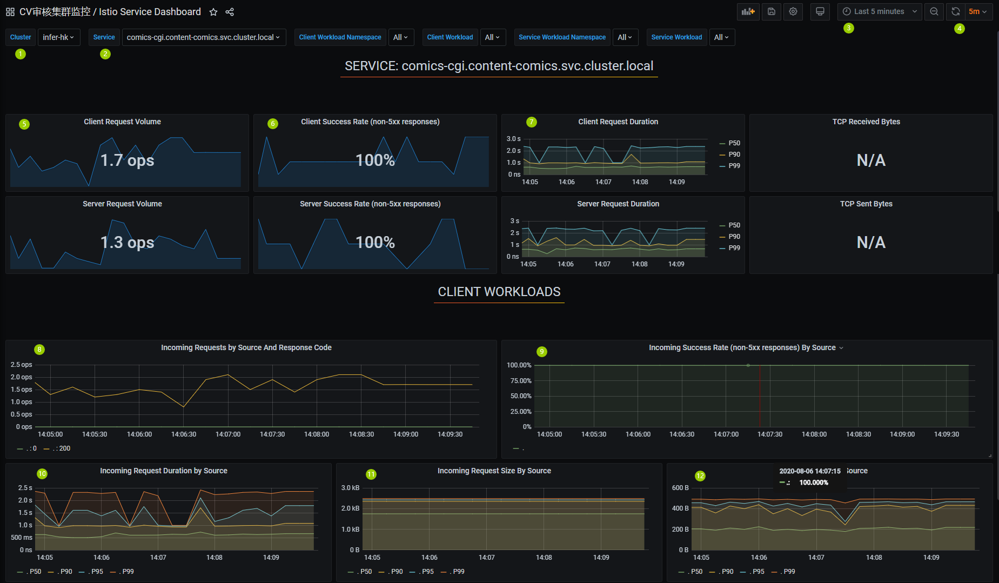

## 简介
grafana是一个监控可视化界面.可以查看服务的运行状况,有诸多维度的信息提供参考.
## 使用方法
如下图是漫画化服务某一时刻的监控信息:  
  
### 标注解释:
1. 选择集群. 内容生产服务均部署在`infer-hk`集群, 因此选择`infer-hk`即可.
2. 选择服务. 根据自己的服务名进行搜索,选择标有`-cgi`的选项, 注意区分灰度环境服务(标有`-grey`)和生产环境服务.
3. 选择监控时间范围. 可选择某一时间段或最近的一段时间.如果没有数据表示该时间段没有流量产生.
4. 选择自动刷新时间间隔.
5. 客户端请求ops预览. ops等效于qps.
6. 客户端请求成功率预览. 百分数表示请求成功率(http非5xx响应).
7. 客户端请求平均处理时间预览. P50表示50分位耗时(将耗时时长从低到高排序,第50%个请求的耗时),其他同理.
8. 客户端请求ops详细信息. ops等效于qps. 这里的状态码`200`表示http请求的状态码(请求成功), 与服务的错误码无关.
9. 客户端请求成功率详细信息.
10. 客户端请求平均处理时间详细信息. P50表示50分位耗时.
11. 客户端请求包大小. 无需关注.
12. 客户端响应包大小. 无需关注.  

### 注释
1. 只要关心客户端相关的图表即可.