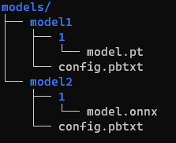

### 背景
--------------------------
[triton-inference-server](https://github.com/NVIDIA/triton-inference-server)是英伟达开源的机器学习模型生产部署框架. 支持grpc及http接口, 其中grpc的默认端口为：8001， http的默认端口为8000  
如果你在使用过程中,遇到并解决了任何问题,请帮助我们完善相关文档(向master分支提交MR).  
目前集群上GPU环境均为cuda:10.1, cuda driver:418. 由于pytorch trace的限制(坑), 所以本地的cuda和cuda driver必须保持与集群一致, 否则无法正常使用.  

### 优点
---------------------------
1. 多框架支持：  
    - tensorRT
    - tensorflow graph
    - tensorflow saved model
    - onnx
    - pytorch
    - caffe2  
2. 支持同一个模型部署多个实例，并行化推理
3. 支持模型ensemble部署，后端可以为多个框架
4. 多GPU支持
5. 模型管理及生存状态检查

### 构建
---------------------------
1. 导出模型
    1. 参考`export_model.py`, 导出模型
        - 推荐导出为`.pt`格式的模型(导出为onnx模型可能会存在推理结果不一致的情况)
        - 输入输出数据类型请使用float，onnx及pt均不支持模型输入为uint8

    2. 按照如下结构添加模型：  
      
        - 其中`config.pbtxt`文件为**必需**，其中包含了模型的平台及输入输出等信息。如果需要部署多个实例并配置gpu等额外操作，则需要在该文件中声明
        - 文件夹`1`为**必需**，代表模型的版本，多个版本直接在该文件夹的同级依次添加数字命名的文件夹并包含模型
2. 构建docker镜像
    修改`build.sh`中的`IMAGE_NAME`变量为镜像名称，参考[docker 镜像命名规范](http://wiki.bigo.sg:8090/pages/viewpage.action?pageId=179601831)  
    运行脚本：`bash build.sh`
 
3. 创建docker容器
    修改`run.sh`文件中的镜像名称(与上一步生成的镜像名称相同)
    运行脚本：  
    `bash run.sh`
4. 接口调用  
    1. 创建python虚拟环境
    2. 安装相关依赖库：  
     `pip install -r requirements.txt`
    3. 修改下列接口文件main函数中的`address`, `model_name`, 和`model_version`进行调用测试。
       - grpc接口：使用`grpc_client.py`
       - http接口：使用`http_client.py`
       - **推荐**使用grpc接口。经测试，http接口的平均推理耗时比grpc接口高20%左右
       

### 常见问题
-----------------------
1. 目前支持的cuda版本>=10.0，cuda驱动版本>=410。
 
