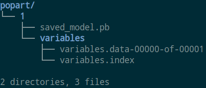

### 背景
[tensorflow serving](https://github.com/tensorflow/serving)是一个用于机器学习模型部署的高性能开源库。  
它可以将训练好的机器学习模型部署到生产环境，使用 gRPC 或http作为接口接受外部调用。  
这也是我们积累经验最多的部署工具，推荐优先使用。  
如果你在使用过程中,遇到并解决了任何问题,请帮助我们完善相关文档(向master分支提交MR).

### 优点
1. 支持模型版本控制和回滚，模型版本热更新
2. 支持并发，实现高吞吐量
3. 支持多模型部署
4. 支持分布式模型
5. 有易于使用的api

### 单模型构建
1. 导出模型  
`tf serving`仅支持`saved model`格式的模型，格式如下：  
  
其中最外层的目录名为模型名称，目录‘1’为版本号（必需）  
模型导出方法请参考`export_saved_model.py`

2. 构建docker image  
    修改`build.sh`文件
    - 修改`MODEL_NAME`变量为模型名称（与1中相同，注意大小写）
    - 修改`IMAGE_NAME`变量为docker image名称，参考[docker image命名规范](http://wiki.bigo.sg:8090/pages/viewpage.action?pageId=179601831)  
    
    运行脚本:  
    `bash build.sh`

3. 创建docker container  
    修改`run_tf_serving.sh`文件，使用其中的single model部分。修改其中的端口映射，gpu，及image名称。  
    注：grpc接口（推荐）端口为8500，http接口端口为8501  
    运行脚本:  
    `bash run_tf_serving.sh`

4. 接口调用  
    1. 创建python虚拟环境
    2. 安装相关依赖库  
    `pip install -r requirements.txt`
    3. 修改`tf_rpc_client.py`中`TfRpcClient.infer`的input/output tensor名称  
       该tensor名称与1中的导出模型相同，可通过以下命令查看：  
       `saved_model_cli show --all --dir <model path>`
    4. 修改`tf_rpc_client.py`中main函数的`TfRpcClient`的`rpc_address`和`model_name`进行调用测试。

### 多模型构建
一个tf serving会直接将一张或多张gpu显存占满（取决于你指定了多少个gpu，推荐每个serving仅指定一个gpu）。  
对于较小的模型，调用次数不多的模型，这样会造成gpu资源的浪费， 因此可以使用一个serving部署多个模型。
1. 导出模型  
    参考单模型构建的1  

2. 构建docker image  
    对于多模型部署，首先需要创建一个json格式的config文件，参考`models/models.config`，其中定义了模型名称，路径，版本等信息。  
    修改`build_ensemble.sh`中的`IMAGE_NAME`.   
    运行脚本：  
    `bash build_ensemble.sh`  
    注：
     - config文件的版本信息非必需，如果未定义版本，则会加载相应路径下最高版本的模型
     - 参考config文件中使用了三种版本定义方式，分别是所有，最近的N个版本，特定的版本

3. 构建docker container  
    修改`run_tf_serving.sh`文件，使用其中的multi model部分。修改其中的端口映射，gpu，及image名称。  
    注：
     - grpc接口（推荐）端口为8500，http接口端口为8501
     - 可添加`model_config_file_poll_wait_seconds=60`选项，表示每过60秒重新检查config文件，与原来不一致的话则重新加载模型。
     - 可添加`--enable_model_warmup`选项（需要添加TFRECORD格式的测试数据在模型目录下,不实用,故不推荐），表示热启动模型。

    运行脚本:  
    `bash run_tf_serving.sh`

4. 接口调用  
    参考单模型构建的1
### 常见问题
1. 模型第一次推理耗时很高  
    tf serving在构建的时候会有一些lazy的操作，所以在第一次推理时耗时很高（初始化一些优化操作），后续的推理耗时会大幅下降。  
    网络的输入如果是任意大小，那么当输入尺寸改变时，框架会针对该尺寸进行优化，会导致耗时较高。但下次该尺寸进行推理时，耗时会大幅下降。
